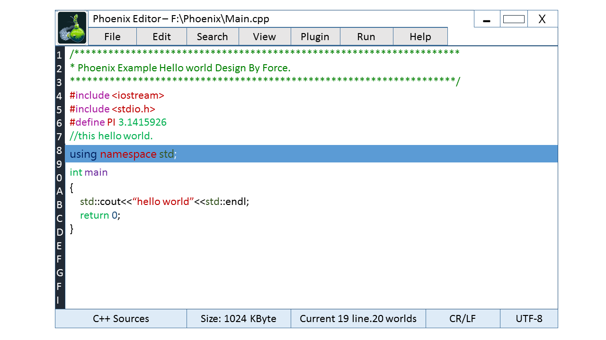

#Phoenix Editor

next ....

###Modern UI
Design:       
   

Simple style CodeWriter style interface: 

next ....

###Plugin Subsystem.
Tiny C Compiler Support.

C language Script

###Build
PowerShell 

next.... 

###Install
next ....

###Design Insider
[Container](./doc/Container/Container.zh-CN.md)

####Copyright:
Copyright &copy; 2015 ForceStudio. All Rights Reserved.

