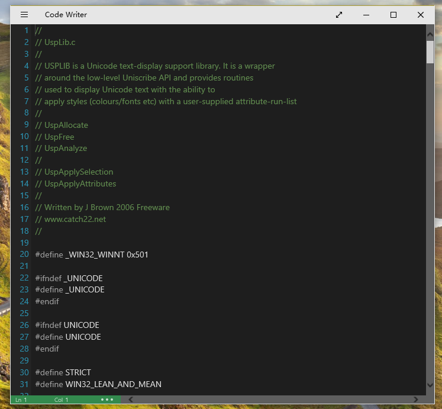

# Phoenix Editor

next ....

### UI Design

We like Spartan UI:       
       

Simple style CodeWriter style UI:      
       
next ....

### Plugin Subsystem.

Tiny C Compiler Support.

C language Script

### Build

We use powershell auto build Phoenix Editor:   
First create nmake's binary.   
Second Run nmake execute Makefile. 

nmake port from sscli20,[sscli20](http://www.microsoft.com/en-us/download/details.aspx?id=4917)    
NMAKE Github Source: [NMAKE](https://github.com/fstudio/nmake/)   

### Install

### Design Insider

[Container](./doc/Container/Container.zh-CN.md)

