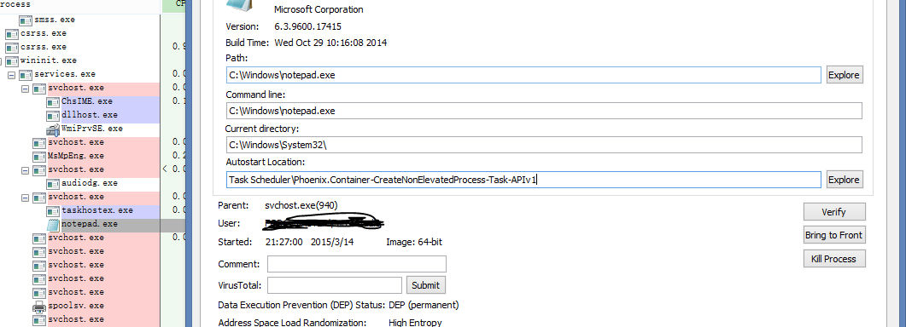

#Phoenix 插件容器介绍


###1.启动低完整性进程
[强制完整性控制](http://zh.wikipedia.org/zh-cn/%E5%BC%BA%E5%88%B6%E5%AE%8C%E6%95%B4%E6%80%A7%E6%8E%A7%E5%88%B6)（英语：Mandatory Integrity Control）是一个在微软Windows操作系统中从Windows Vista开始引入，并沿用到后续版本系统的核心安全功能。强制完整性控制通过完整性级别标签来为运行于同一登录会话的进程提供隔离。此机制的目的是在一个潜在不可信的上下文（与同一账户下运行的其他较为可信的上下文相比）中选择性地限制特定进程和软件组件的访问权限。   
Windows Vista 定义了四个完整性级别:
>低 (SID: S-1-16-4096)   
>中 (SID: S-1-16-8192)   
>高 (SID: S-1-16-12288)  
>系統 (SID: S-1-16-16384)   

利用这一特性，我们可以使用低级别权限启动一个进程:

```C++
#include <Windows.h>
#include <Sddl.h>
#include <cstdio>
#include <cstdlib>
#include <cstring>
#include <wchar.h>
#include <iostream>


#pragma comment(lib,"kernel32")
#pragma comment(lib,"Advapi32")
#pragma comment(lib,"user32")

BOOL WINAPI CreateLowLevelProcess(LPCWSTR lpCmdLine) {
  BOOL b;
  HANDLE hToken;
  HANDLE hNewToken;
  // PWSTR szProcessName = L"LowClient";
  PWSTR szIntegritySid = L"S-1-16-4096";
  PSID pIntegritySid = NULL;
  TOKEN_MANDATORY_LABEL TIL = {0};
  PROCESS_INFORMATION ProcInfo = {0};
  STARTUPINFOW StartupInfo = {0};
  StartupInfo.cb=sizeof(STARTUPINFOW);
  ULONG ExitCode = 0;

  b = OpenProcessToken(GetCurrentProcess(), MAXIMUM_ALLOWED, &hToken);
  if(!b)
	  return FALSE;
  b = DuplicateTokenEx(hToken, MAXIMUM_ALLOWED, NULL, SecurityImpersonation,
                       TokenPrimary, &hNewToken);
  b = ConvertStringSidToSidW(szIntegritySid, &pIntegritySid);
  TIL.Label.Attributes = SE_GROUP_INTEGRITY;
  TIL.Label.Sid = pIntegritySid;

  // Set process integrity levels
  b = SetTokenInformation(hNewToken, TokenIntegrityLevel, &TIL,
                          sizeof(TOKEN_MANDATORY_LABEL) +
                              GetLengthSid(pIntegritySid));

  // Set process UI privilege level
  /*b = SetTokenInformation(hNewToken, TokenIntegrityLevel,
  &TIL, sizeof(TOKEN_MANDATORY_LABEL) + GetLengthSid(pIntegritySid)); */
  wchar_t *lpCmdLineT = _wcsdup(lpCmdLine);
  // To create a new low-integrity processes
  b = CreateProcessAsUserW(hNewToken, NULL, lpCmdLineT, NULL, NULL, FALSE, 0,
                          NULL, NULL, &StartupInfo, &ProcInfo);
  CloseHandle(hToken);  
  CloseHandle(hNewToken);
  LocalFree(pIntegritySid);
  free(lpCmdLineT);
  return b;
}

int wmain(int argc,wchar_t *argv[])
{
	if(argc>=2)
	{
		std::wcout<<L"Start LowLevel App: "<<argv[1]<<L"\t Return Code[BOOL]: "<<CreateLowLevelProcess(argv[1])<<std::endl;
	}
	return 0;
}

```
第一步获得当前进程的Token,然后使用这个令牌创建一个新的令牌，由SID "S-1-16-4096"得到一个SID指针，将SID指针添加到TOKEN_MANDATORY_LABEL结构中，而后用SetTokenInformation将令牌与
完整性级别结合在一起，最后使用CreateProcessAsUser创建进程。通过完整性级别启动的进程是没有多少权限的，譬如打开一个记事本，新建一个文件另存为，基本上都无法写入。
使用Process Explorer可以查看启动进程的权限属性。

标准权限的进程通常如下：

实际上，光从属性上看两者之间并没有明显的差别
当低完整性进程对目录进行写入时，出现下图所示：


###2.UAC降权
[用户账户控制](http://zh.wikipedia.org/zh-cn/%E4%BD%BF%E7%94%A8%E8%80%85%E5%B8%B3%E6%88%B6%E6%8E%A7%E5%88%B6)是Windows Vista推出的新功能，

通过计划任务能够实现程序的UAC降权

```C++
#include <Windows.h>
#include <stdio.h>
#include <shlobj.h>
#include <Shlwapi.h>
#include <Objbase.h>
#include <string>
#include <taskschd.h>
#include <comdef.h>
#include <Sddl.h>
#include <string.h>
#include <wchar.h>


#pragma comment(lib,"Shlwapi")
#pragma comment(lib,"kernel32")
#pragma comment(lib,"user32")
#pragma comment(lib,"Taskschd")
#pragma comment(lib,"comsupp")
#pragma comment(lib,"credui")
#pragma comment(lib,"Advapi32")
#pragma comment(lib,"Ole32")
#pragma comment(lib,"Shell32")

#ifndef ASSERT
#ifdef _DEBUG
#include <assert.h>
#define ASSERT(x) assert(x)
#define ASSERT_HERE assert(FALSE)
#else // _DEBUG
#define ASSERT(x)
#define ASSERT_HERE
#endif //_DEBUG
#endif // ASSERT

#ifndef _tsizeof
#define _tsizeof(s) (sizeof(s) / sizeof(s[0]))
#endif //_tsizeof

template <class Interface>
inline void SafeRelease(Interface **ppInterfaceToRelease) {
  if (*ppInterfaceToRelease != nullptr) {
    (*ppInterfaceToRelease)->Release();

    (*ppInterfaceToRelease) = nullptr;
  }
}

#define DO(action)                                                             \
  if (FAILED( action )) {                                                        \
    ASSERT( FALSE );                                                             \
    goto ClenUp;                                                               \
  }

HRESULT WINAPI TaskUACRunNonElevated(LPCWSTR pszPath, LPCWSTR pszParameters,
                                     LPCWSTR pszDirectory) {
  // If Your User is Administrator (Windows Default) Task run dafault by
  // Administrator,So, user Explorer's Token <CreateProcessAsTokenW>
  // ITaskSettings3
  /**************************************************************************
  *  ITaskSettings3 Support Windows 8 or Later,This App Support Windows 7
  *  So Use ITaskSettings2
  **************************************************************************/
  // ITaskSettings2 iTask;

  HRESULT hr = S_OK;
  ITaskService *iTaskService = nullptr;
  ITaskFolder *iRootFolder = nullptr;
  ITaskDefinition *iTask = nullptr;
  IRegistrationInfo *iRegInfo = nullptr;
  IPrincipal *iPrin = nullptr;
  ITaskSettings *iSettings = nullptr;
  ITriggerCollection *iTriggerCollection = nullptr;
  ITrigger *iTrigger = nullptr;
  IRegistrationTrigger *iRegistrationTrigger = nullptr;
  IActionCollection *iActionCollection = nullptr;
  IAction *iAction = nullptr;
  IExecAction *iExecAction = nullptr;
  IRegisteredTask *iRegisteredTask = nullptr;

  LPCWSTR pszTaskName = L"Phoenix.Container-CreateNonElevatedProcess-Task-APIv1";

  DO(hr = CoCreateInstance(CLSID_TaskScheduler, nullptr, CLSCTX_INPROC_SERVER,IID_ITaskService, (void **)&iTaskService));
  //WCHAR szError=

  DO(iTaskService->Connect(_variant_t(), _variant_t(), _variant_t(), _variant_t()));

  DO(iTaskService->GetFolder(_bstr_t(L"\\"), &iRootFolder));
  iRootFolder->DeleteTask(_bstr_t(pszTaskName), 0);

  DO(iTaskService->NewTask(0, &iTask));

  DO(iTask->get_RegistrationInfo(&iRegInfo));

  DO(iRegInfo->put_Author(L"PhoenixContainerRunLimitUser"));

  DO(iTask->get_Principal(&iPrin));

  DO(iPrin->put_Id(_bstr_t(L"PhoenixContainerRunLimitUser_Principal")))

  DO(iPrin->put_LogonType(TASK_LOGON_INTERACTIVE_TOKEN))

  //  Run the task with the least privileges (LUA)
  DO(iPrin->put_RunLevel(TASK_RUNLEVEL_LUA))

  //  Create the settings for the task

  DO(iTask->get_Settings(&iSettings))

  //  Set setting values for the task.
  DO(iSettings->put_StartWhenAvailable(VARIANT_BOOL(true)))

  //  Get the trigger collection to insert the registration trigger.

  DO(iTask->get_Triggers(&iTriggerCollection))

  //  Add the registration trigger to the task.

  DO(iTriggerCollection->Create(TASK_TRIGGER_REGISTRATION, &iTrigger))

  DO(iTrigger->QueryInterface(IID_IRegistrationTrigger,
                              (void **)&iRegistrationTrigger))

  DO(iRegistrationTrigger->put_Id(
      _bstr_t(L"PhoenixContainerRunLimitUser_Trigger")))

  //  Define the delay for the registration trigger.
  DO(iRegistrationTrigger->put_Delay(L"PT0S")) // 0 second delay of execution;

  //  Add an Action to the task. This task will execute notepad.exe.

  //  Get the task action collection pointer.
  DO(iTask->get_Actions(&iActionCollection))

  //  Create the action, specifying that it is an executable action.

  DO(iActionCollection->Create(TASK_ACTION_EXEC, &iAction))

  //  QI for the executable task pointer.
  DO(iAction->QueryInterface(IID_IExecAction, (void **)&iExecAction))

  //  Set the path of the executable to notepad.exe.
  DO(iExecAction->put_Path(_bstr_t(pszPath)))

  if (pszParameters) {
    DO(iExecAction->put_Arguments(_bstr_t(pszParameters)))
  }

  if (pszDirectory) {
    DO(iExecAction->put_WorkingDirectory(_bstr_t(pszDirectory)))
  }

  //  Save the task in the root folder.

  DO(iRootFolder->RegisterTaskDefinition(
      _bstr_t(pszTaskName), iTask, TASK_CREATE_OR_UPDATE, _variant_t(),
      _variant_t(), TASK_LOGON_INTERACTIVE_TOKEN, _variant_t(L""),
      &iRegisteredTask));
  hr = S_OK;
  goto ClenUp;

ClenUp:
  SafeRelease(&iTaskService);
  SafeRelease(&iTask);
  SafeRelease(&iRootFolder);
  SafeRelease(&iRegInfo);
  SafeRelease(&iPrin);
  SafeRelease(&iRegistrationTrigger);
  SafeRelease(&iTriggerCollection);
  SafeRelease(&iTrigger);
  SafeRelease(&iActionCollection);
  SafeRelease(&iSettings);
  SafeRelease(&iAction);
  SafeRelease(&iExecAction);
  SafeRelease(&iRegisteredTask);
  return hr;
}

int wmain(int argc,wchar_t *argv[])
{
	if(argc>=2)
	{
		CoInitialize(NULL);
		if(_waccess(argv[1],04)==0&&IsUserAnAdmin())
		{
			wprintf(L"TaskUACRunNonElevated Process: %d\n",TaskUACRunNonElevated(argv[1],nullptr,nullptr));
	    }else{
			wprintf(L"Not Found This App,Or Not a Administrator User: %s\n",argv[1]);
		}
		CoUninitialize();
	}
	return 0;
}

```
使用Process Explorer 查看属性，发现是由taskhostex（）启动,并且Autostart Location显示为计划任务的名称。


####2.1计划任务降权的特例
通过计划任务降权在UAC开启的系统上基本上都会成功，但是，如果用户账户是内置的管理员账户，也就是Administrator，并且开启了**[对内置管理员使用批准模式](https://technet.microsoft.com/zh-cn/library/dd834795.aspx)**,那么上述的通过计划任务降权通常会失败，但是官方的任务管理器能够成功的降权，无论是[Process Explorer](http://www.sysinternals.com/)，还是[Process Hacker](http://processhacker.sourceforge.net/)都降权失败，即依然运行的是管理员权限的程序。当然，使用CreateProcessAsUser或者CreateProcessWithTokenW除外。
如果你的Shell没有被异常终止，也就是Explorer作为桌面启动的实例以标准权限运行着。依然可以降权，不过这种程序的权限完整性并不能达到理想。与低完整性权限类似，都是要获取已有的Token，然后使用此Token启动新的进程，不过前者是基于用户的Token,而后者是基于进程的Token。

```C++
HRESULT WINAPI
CreateProcessWithShellToken(LPCWSTR exePath, _In_ LPCWSTR cmdArgs,
                            _In_ LPCWSTR workDirectory, _In_ STARTUPINFOW &si,
                            _Inout_ PROCESS_INFORMATION &pi) {
  HANDLE hShellProcess = nullptr, hShellProcessToken = nullptr,
         hPrimaryToken = nullptr;
  HWND hwnd = nullptr;
  DWORD dwPID = 0;
  HRESULT hr = S_OK;
  BOOL ret = TRUE;
  DWORD dwLastErr;

  // Enable SeIncreaseQuotaPrivilege in this process.  (This won't work if
  // current process is not elevated.)
  HANDLE hProcessToken = nullptr;
  if (!OpenProcessToken(GetCurrentProcess(), TOKEN_ADJUST_PRIVILEGES,
                        &hProcessToken)) {
    return HRESULT(1);
  } else {
    TOKEN_PRIVILEGES tkp;
    tkp.PrivilegeCount = 1;
    LookupPrivilegeValueW(nullptr, SE_INCREASE_QUOTA_NAME,
                          &tkp.Privileges[0].Luid);
    tkp.Privileges[0].Attributes = SE_PRIVILEGE_ENABLED;
    AdjustTokenPrivileges(hProcessToken, FALSE, &tkp, 0, nullptr, nullptr);
    dwLastErr = GetLastError();
    CloseHandle(hProcessToken);
    if (ERROR_SUCCESS != dwLastErr) {
      return HRESULT(2);
    }
  }

  // Get an HWND representing the desktop shell.
  // CAVEATS:  This will fail if the shell is not running (crashed or
  // terminated), or the default shell has been
  // replaced with a custom shell.  This also won't return what you probably
  // want if Explorer has been terminated and
  // restarted elevated.
  hwnd = GetShellWindow();
  if (nullptr == hwnd) {
    return HRESULT(3);
  }

  GetWindowThreadProcessId(hwnd, &dwPID);
  if (0 == dwPID) {
    return HRESULT(4);
  }

  // Open the desktop shell process in order to query it (get the token)
  hShellProcess = OpenProcess(PROCESS_QUERY_INFORMATION, FALSE, dwPID);
  if (!hShellProcess) {
    dwLastErr = GetLastError();
    return HRESULT(5);
  }

  // From this point down, we have handles to close, so make sure to clean up.

  bool retval = false;
  // Get the process token of the desktop shell.
  ret = OpenProcessToken(hShellProcess, TOKEN_DUPLICATE, &hShellProcessToken);
  if (!ret) {
    dwLastErr = GetLastError();
    hr = HRESULT(6);
    goto cleanup;
  }

  // Duplicate the shell's process token to get a primary token.
  // Based on experimentation, this is the minimal set of rights required for
  // CreateProcessWithTokenW (contrary to current documentation).
  const DWORD dwTokenRights = TOKEN_QUERY | TOKEN_ASSIGN_PRIMARY |
                              TOKEN_DUPLICATE | TOKEN_ADJUST_DEFAULT |
                              TOKEN_ADJUST_SESSIONID;
  ret = DuplicateTokenEx(hShellProcessToken, dwTokenRights, nullptr,
                         SecurityImpersonation, TokenPrimary, &hPrimaryToken);
  if (!ret) {
    dwLastErr = GetLastError();
    hr = 7;
    goto cleanup;
  }
  // Start the target process with the new token.
  wchar_t *cmdArgsT = _wcsdup(cmdArgs);
  ret = CreateProcessWithTokenW(hPrimaryToken, 0, exePath, cmdArgsT, 0, nullptr,
                                workDirectory, &si, &pi);
  free(cmdArgsT);
  if (!ret) {
    dwLastErr = GetLastError();
    hr = 8;
    goto cleanup;
  }

  retval = true;

cleanup:
  // Clean up resources
  CloseHandle(hShellProcessToken);
  CloseHandle(hPrimaryToken);
  CloseHandle(hShellProcess);
  return hr;
}
```

###3.使用AppContainer运行程序
自Windows 8起


###备注
开启 对内置管理员的批准模式
>运行（Win+R）输入"gpedit.msc",打开组策略编辑器，依次展开“计算机配置”里面的“Windows设置”，然后是“安全设置”，再就是“本地策略”里面的“安全选项”，在右边查找一项策略：“用户帐户控制: 用于内置管理员账户的管理员批准模式”，双击打开更改为“已启用”。